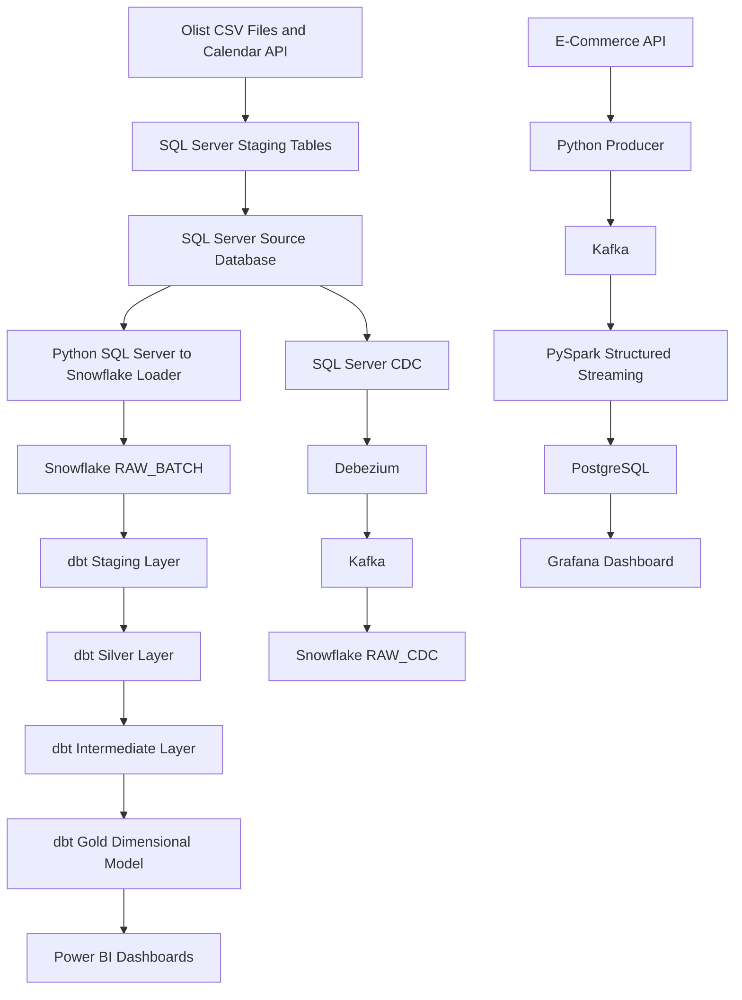
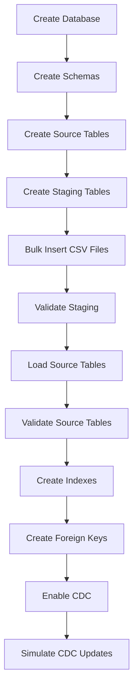
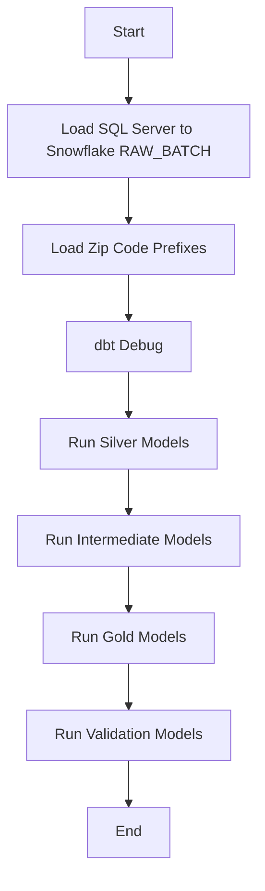

# 🛒 E-Commerce Data Platform

[](#-sql-server-source-system)
[](#-snowflake-data-warehouse)
[](#-dbt-transformation-layers)
[](#-airflow-orchestration)
[](#-cdc-and-streaming-pipelines)
[](#-power-bi-dashboard)
[](#-tools--technologies)
[](#-project-highlights)

Welcome to the **E-Commerce Data Platform** repository.  
This project presents a complete end-to-end **Data Engineering and Analytics Platform** for the Brazilian Olist e-commerce dataset using **SQL Server**, **Snowflake**, **dbt**, **Airflow**, **Kafka**, **Debezium**, **PySpark**, **PostgreSQL**, **Grafana**, and **Power BI**.

The main goal of this project is to transform raw e-commerce data into a clean, validated, business-ready analytical platform that supports **batch analytics**, **CDC-based change tracking**, **streaming monitoring**, and **interactive business dashboards**.

---

## 📌 Project Overview

This project simulates a modern e-commerce data platform with multiple data engineering patterns:

1. **Batch Pipeline**  
   Raw Olist data is loaded into SQL Server, validated, ingested into Snowflake, transformed with dbt, and visualized in Power BI.

2. **CDC Pipeline**  
   SQL Server CDC is prepared to capture source changes using Debezium and Kafka, then land change events into Snowflake for future SCD Type 2 modeling.

3. **Real-Time Streaming Pipeline**  
   E-commerce API events are produced to Kafka, processed with PySpark Structured Streaming, stored in PostgreSQL, and monitored through Grafana.

4. **Analytics Engineering with dbt**  
   The warehouse is modeled through staging, silver, intermediate, gold, and validation layers.

5. **Business Intelligence Reporting**  
   Power BI dashboards are built on the final gold dimensional model to monitor sales, operations, products, and order details.

---

## 🏗️ End-to-End Architecture




---

## 🛠️ Tools & Technologies

| Tool | Purpose |
|---|---|
| **SQL Server** | Operational source database, staging, source tables, CDC setup |
| **T-SQL** | Database creation, bulk loading, validation, indexes, foreign keys |
| **Python** | SQL Server to Snowflake ingestion and calendar data preparation |
| **Snowflake** | Cloud data warehouse for raw, transformed, and analytics-ready data |
| **dbt** | Data transformation, modeling, testing, validation, and documentation |
| **Apache Airflow** | Pipeline orchestration for ingestion and dbt runs |
| **Kafka** | Event streaming platform for CDC and real-time data |
| **Debezium** | CDC connector for reading SQL Server changes |
| **PySpark Structured Streaming** | Real-time stream processing |
| **PostgreSQL** | Storage layer for Grafana streaming dashboard |
| **Grafana** | Real-time monitoring dashboard |
| **Power BI** | Business intelligence dashboards |
| **Docker** | Containerized services for Airflow and CDC stack |
| **GitHub** | Version control and project documentation |

---

## 📂 Repository Structure

```text
ecommerce-data-platform/
│
├── Data Scripts/
│
├── Grafana/
│   └── dashboard.json
│
├── Power BI/
│   └── E-commerce.pbix
│
├── Stream&CDC/
│   ├── checkpoints/
│   ├── connect/
│   │   └── Dockerfile
│   ├── connectors/
│   │   ├── debezium_sqlserver_connector.json
│   │   └── snowflake_sink_connector.json
│   ├── jars/
│   │   ├── commons-pool2-2.11.1.jar
│   │   ├── kafka-clients-3.5.1.jar
│   │   ├── postgresql-42.7.3.jar
│   │   ├── spark-sql-kafka-0-10_2.12-3.5.x.jar
│   │   └── spark-token-provider-kafka-0-10_2.12-3.5.x.jar
│   ├── jmx-exporter/
│   ├── consumer.ipynb
│   ├── docker-compose.yaml
│   └── producer.py
│
├── data/
│   └── raw/
│       ├── calendar/
│       │   └── brazil_holidays_weekends_2016_2018.csv
│       └── olist/data_set/
│           ├── olist_customers_dataset.csv
│           ├── olist_order_items_dataset.csv
│           ├── olist_order_payments_dataset.csv
│           ├── olist_order_reviews_dataset.csv
│           ├── olist_orders_dataset.csv
│           ├── olist_products_dataset.csv
│           ├── olist_sellers_dataset.csv
│           └── product_category_name_translation.csv
│
├── sql/
│   ├── snowflake/
│   │   ├── 01_create_database_and_schemas.sql
│   │   ├── 02_create_raw_batch_tables.sql
│   │   └── 03_create_stream_batch_tables.sql
│   └── source_db/
│       ├── 01_create_database.sql
│       ├── 02_create_schemas.sql
│       ├── 03_create_tables.sql
│       ├── 04_create_staging_tables.sql.sql
│       ├── 05_load_staging_bulk_insert.sql
│       ├── 06_validate_staging.sql.sql
│       ├── 07_load_source_tables.sql.sql
│       ├── 08_validate_source_tables.sql.sql
│       ├── 09_create_indexes.sql.sql
│       ├── 13_simulate_cdc_updates.sql
│       ├── 14_create_foreign_keys.sql
│       └── cdc_setup.sql
│
├── scripts/
│   ├── load_sqlserver_to_snowflake.py
│   ├── load_zip_code_prefixes_to_snowflake.py
│   └── weekends_holidays.py
│
├── dbt/
│   └── ecommerce_analytics/
│       ├── analyses/
│       ├── macros/
│       ├── models/
│       │   ├── sources/
│       │   ├── staging/
│       │   ├── silver/
│       │   ├── intermediate/
│       │   ├── gold/
│       │   └── validation/
│       ├── seeds/
│       ├── snapshots/
│       ├── tests/
│       ├── README.md
│       └── dbt_project.yml
│
├── docker/
│   ├── airflow/
│   │   ├── dags/
│   │   ├── logs/
│   │   ├── plugins/
│   │   ├── profiles/
│   │   ├── Dockerfile
│   │   ├── docker-compose.yml
│   │   └── requirements.txt
│   └── cdc/
│
├── screenshot/
├── README.md
└── requirements.txt
```

---

## 📊 Data Source

The project is based on the **Brazilian E-Commerce Public Dataset by Olist** from Kaggle.

The raw dataset includes:

| Dataset | Description |
|---|---|
| `olist_customers_dataset.csv` | Customer information |
| `olist_orders_dataset.csv` | Orders, statuses, and timestamps |
| `olist_order_items_dataset.csv` | Products inside each order, price, freight, and seller |
| `olist_order_payments_dataset.csv` | Payment methods, installments, and values |
| `olist_order_reviews_dataset.csv` | Customer reviews and scores |
| `olist_products_dataset.csv` | Product metadata and dimensions |
| `olist_sellers_dataset.csv` | Seller information |
| `olist_geolocation_dataset.csv` | Geolocation information by zip code prefix |
| `product_category_name_translation.csv` | Portuguese to English category mapping |
| `brazil_holidays_weekends_2016_2018.csv` | Calendar, weekends, and holidays |

---

<a id="-sql-server-source-system"></a>

## 🗄️ SQL Server Source System

SQL Server is used as the project source system / OLTP simulation layer.

The SQL scripts build a complete source database called:

```text
Ecommerce_Source_DB
```

### SQL Server Flow



### SQL Server Scripts

| Script | Purpose |
|---|---|
| `01_create_database.sql` | Creates `Ecommerce_Source_DB` |
| `02_create_schemas.sql` | Creates `sales`, `geolocation`, and `calendar` schemas |
| `03_create_tables.sql` | Creates final source tables |
| `04_create_staging_tables.sql.sql` | Creates staging tables for raw CSV loading |
| `05_load_staging_bulk_insert.sql` | Loads raw files into staging tables using `BULK INSERT` |
| `06_validate_staging.sql.sql` | Validates staging data quality |
| `07_load_source_tables.sql.sql` | Loads clean data from staging into source tables |
| `08_validate_source_tables.sql.sql` | Validates final source tables |
| `09_create_indexes.sql.sql` | Creates indexes for extraction and query performance |
| `cdc_setup.sql` | Enables CDC and prepares Debezium access |
| `13_simulate_cdc_updates.sql` | Simulates updates to test CDC behavior |
| `14_create_foreign_keys.sql` | Adds relational integrity and zip code bridge support |

---

## ❄️ Snowflake Data Warehouse

Snowflake is used as the cloud data warehouse for batch, CDC, streaming, and analytics layers.

### Snowflake Schemas

| Schema | Purpose |
|---|---|
| `RAW_BATCH` | Raw batch data loaded from SQL Server |
| `RAW_STREAM` | Raw real-time events from the streaming pipeline |
| `RAW_CDC` | Raw change events captured by Debezium/Kafka |
| `SILVER` | Cleaned and standardized analytical tables |
| `GOLD` | Final dimensional model for BI dashboards |

### Snowflake Scripts

| Script | Purpose |
|---|---|
| `01_create_database_and_schemas.sql` | Creates the warehouse, database, and schemas |
| `02_create_raw_batch_tables.sql` | Creates raw batch tables |
| `03_create_stream_batch_tabels.sql` | Creates raw stream tables |

---

## 🐍 Python Ingestion

Python is used to load SQL Server source data into Snowflake.

### Main Scripts

| Script | Purpose |
|---|---|
| `load_sqlserver_to_snowflake.py` | Loads SQL Server source tables into Snowflake `RAW_BATCH` |
| `load_zip_code_prefixes_to_snowflake.py` | Loads `zip_code_prefixes` separately for geolocation modeling |
| `weekends_holidays.py` | Prepares calendar, weekends, and holidays data |

### Loading Strategy

The main loader uses:

- SQL Server connection through `pyodbc`
- Snowflake connection through `snowflake-connector-python`
- Pandas chunks for scalable reads
- Temporary Snowflake tables
- Merge logic to avoid simple truncate-and-load behavior

---

<a id="-dbt-transformation-layers"></a>

## 🧱 dbt Transformation Layers

The dbt project is located under:

```text
dbt/ecommerce_analytics/
```

The transformation design follows a layered analytics engineering approach:

```text
Sources → Staging → Silver → Intermediate → Gold → Validation
```


---

## 🧾 dbt Sources

The source layer defines the raw Snowflake tables used by dbt.

| Source File | Purpose |
|---|---|
| `raw_batch_sources.yml` | Defines batch raw tables from Snowflake |
| `raw_stream_sources.yml` | Defines streaming raw tables |
| `raw_cdc_sources.yml` | Defines CDC raw event tables |

---

## 🧹 dbt Staging Layer

The staging layer performs the first level of cleaning and standardization.

Main responsibilities:

- Standardize column names
- Trim string values
- Normalize city and state fields
- Cast date and timestamp columns
- Prepare raw batch tables for silver models
- Prepare raw stream tables for unification
- Parse CDC JSON fields such as keys, after-values, operation type, and timestamps

---

## ✨ dbt Silver Layer

The silver layer contains clean analytical versions of the raw business tables.

Instead of deleting problematic records, the project keeps them and creates clear quality flags.  
This makes the pipeline more transparent, auditable, and useful for real business analysis.

### Silver Models

| Model | Main Purpose |
|---|---|
| `silver_orders.sql` | Cleans orders, statuses, timestamps, and delivery metrics |
| `silver_customers.sql` | Cleans customer location and identity data |
| `silver_sellers.sql` | Cleans seller location data |
| `silver_products.sql` | Cleans product metadata and dimension fields |
| `silver_order_items.sql` | Cleans order item prices, freight, and shipping dates |
| `silver_order_payments.sql` | Cleans payment values and invalid payment flags |
| `silver_order_reviews.sql` | Cleans review scores and review timestamps |
| `silver_geolocation.sql` | Deduplicates geolocation data |
| `silver_product_category_translation.sql` | Maps Portuguese categories to English |
| `silver_brazil_holidays.sql` | Prepares calendar, weekends, and public holidays |
| `silver_zip_code_prefixes.sql` | Supports clean geolocation bridge joins |

### Key Silver Cleaning Rules

- Old open orders after 30 days are marked as `expired_unfulfilled`
- Future timestamps after the batch cutoff date are nulled
- Invalid prices and freight values are flagged
- Invalid payment values are excluded from clean revenue logic
- Invalid review scores are flagged
- Missing product categories are replaced with `unknown`
- Missing product photo quantities are replaced with `0`
- Missing product metadata and dimensions are flagged
- Delivery timeline issues are preserved using quality flags

### Important Silver Flags

| Flag | Meaning |
|---|---|
| `has_carrier_before_purchase` | Carrier date is earlier than purchase date |
| `has_carrier_before_approved` | Carrier date is earlier than approval date |
| `has_customer_delivery_before_carrier` | Customer delivery date is earlier than carrier date |
| `has_estimated_delivery_before_purchase` | Estimated delivery date is earlier than purchase date |
| `is_late_delivery` | Delivered after estimated delivery date |
| `is_invalid_price` | Price is missing or invalid |
| `is_invalid_freight_value` | Freight value is missing or invalid |
| `is_invalid_payment_value` | Payment value is less than or equal to zero |
| `is_invalid_review_score` | Review score is outside the accepted range |
| `is_missing_product_metadata` | Product descriptive fields are missing |
| `is_missing_product_dimensions` | Product size or weight data is missing |

---

## 🔗 dbt Intermediate Layer

The intermediate layer combines batch and streaming models into unified datasets.

| Model | Purpose |
|---|---|
| `int_customers_unified.sql` | Combines batch and stream customers |
| `int_orders_unified.sql` | Combines batch and stream orders |
| `int_order_items_unified.sql` | Combines batch and stream order items |
| `int_order_payments_unified.sql` | Combines batch and stream payments |
| `int_order_reviews_unified.sql` | Combines batch and stream reviews |

This layer is not the final business model.  
Its role is to prepare consistent unified data before building the gold dimensional model.

---

## 🏆 dbt Gold Layer

The gold layer contains the final dimensional model used by Power BI.


### Gold Models

| Model | Purpose |
|---|---|
| `dim_date.sql` | Date dimension with weekend and holiday attributes |
| `dim_customer.sql` | Customer dimension with SCD Type 2 support |
| `dim_product.sql` | Product dimension with SCD Type 2 and English category names |
| `dim_seller.sql` | Seller dimension with SCD Type 2 support |
| `dim_payment.sql` | Payment dimension |
| `dim_review.sql` | Review dimension |
| `dim_geolocation.sql` | Geolocation dimension |
| `bridge_geolocation.sql` | Bridge table for zip code prefix relationships |
| `sales_fact.sql` | Main sales fact table |

### Fact Table Grain

```text
order_id + order_item_id
```

### Fact Table Contains

- Date keys
- Customer keys
- Product keys
- Seller keys
- Review and payment keys
- Order status
- Clean order status
- Price and freight values
- Delivery delay metrics
- Data quality flags

---

## ✅ dbt Validation Layer

Validation models are used to check the quality and consistency of each transformation layer.

| Model | Purpose |
|---|---|
| `silver_validation_summary.sql` | Validates batch silver models |
| `stream_silver_validation_summary.sql` | Validates stream silver models |
| `stream_batch_schema_compatibility.sql` | Checks batch and stream compatibility |
| `intermediate_unified_validation_summary.sql` | Validates unified intermediate models |
| `cdc_silver_validation_summary.sql` | Validates CDC silver models |
| `gold_validation_summary.sql` | Validates gold tables, fact grain, keys, SCD2 logic, and KPIs |


---

<a id="-airflow-orchestration"></a>

## 🌬️ Airflow Orchestration

Airflow is used to orchestrate the Snowflake loading and dbt transformation pipeline.

Airflow files are stored under:

```text
docker/airflow/
```

### Airflow DAG Flow



### Airflow Files

| File | Purpose |
|---|---|
| `Dockerfile` | Builds the Airflow image |
| `requirements.txt` | Installs Airflow, dbt, Snowflake, and SQL Server dependencies |
| `docker-compose.yml` | Runs Airflow services |
| `profiles/profiles.yml` | dbt Snowflake profile used inside Airflow |
| `dags/ecommerce_snowflake_dbt_pipeline.py` | Main pipeline DAG |


---

<a id="-cdc-and-streaming-pipelines"></a>

## 🔁 CDC and Streaming Pipelines

The project includes both CDC preparation and real-time streaming architecture.

### CDC Pipeline

```text
SQL Server CDC
        ↓
Debezium
        ↓
Kafka
        ↓
Snowflake RAW_CDC
        ↓
dbt CDC Silver
        ↓
Gold SCD Type 2 Dimensions
```

CDC is prepared to track changes in selected SQL Server tables and support historical dimensions such as customers, products, and sellers.

### Real-Time Streaming Pipeline

```text
E-Commerce API
        ↓
Python Producer
        ↓
Kafka
        ↓
PySpark Structured Streaming
        ↓
PostgreSQL
        ↓
Grafana
```

This pipeline is designed for operational monitoring and real-time dashboarding.

### Stream&CDC Project Files

The real-time and CDC implementation is organized under:

```text
Stream&CDC/
├── checkpoints/
├── connect/
├── connectors/
├── jars/
├── jmx-exporter/
├── consumer.ipynb
├── docker-compose.yaml
└── producer.py
```

| File / Folder | Purpose |
|---|---|
| `producer.py` | Produces real-time e-commerce events into Kafka |
| `consumer.ipynb` | Consumes and validates streaming events |
| `docker-compose.yaml` | Runs the streaming and CDC services |
| `connect/` | Kafka Connect configuration |
| `connectors/` | Debezium and connector configuration files |
| `jars/` | Required connector JAR files |
| `jmx-exporter/` | Monitoring configuration |
| `checkpoints/` | Streaming checkpoint location |

### Grafana Monitoring Screenshots


---

<a id="-power-bi-dashboard"></a>

## 📈 Power BI Dashboard

Power BI is used as the main business intelligence layer.

The dashboard is built on top of the dbt gold dimensional model and focuses on e-commerce business performance.

### Dashboard Pages

| Page | Focus |
|---|---|
| **Overview** | High-level KPIs, revenue, orders, customers, and sales trends |
| **Operations** | Delivery performance, late orders, order status, and operational quality |
| **Products** | Category performance, product revenue, and product quality indicators |
| **Sales Details** | Detailed order-level and item-level analysis |

### Dashboard Screenshots

#### 📌 Overview


#### 🚚 Operations


#### 📦 Products


#### 💰 Sales Details


---

## 🖼️ Project Screenshots

All project screenshots are stored under:

```text
screenshot/
```

<details>
<summary><strong>View All Screenshots</strong></summary>

### Architecture


### Dimensional Modeling


### Schema


### dbt Lineage Graph


### dbt Pipeline Run


### Airflow DAG Run Details


### Grafana Dashboard


### Grafana Alert Email


### Power BI Overview


### Power BI Operations


### Power BI Products


### Power BI Sales Details


</details>

---

## 📐 Data Modeling

The final analytical model follows dimensional modeling principles.

### Main Design Concepts

- **Fact table** for measurable sales events
- **Dimension tables** for descriptive business entities
- **Bridge table** for zip code prefix and geolocation relationships
- **SCD Type 2** for tracking CDC-driven historical changes
- **Date dimension** enriched with weekends and Brazilian public holidays
- **Quality flags** to keep data issues visible instead of silently removing them

### Main Fact Table

#### `sales_fact`

Stores sales transaction details at the order-item level.

**Grain:** One row per order item.

Main analytical fields:

- Order identifiers
- Customer, product, seller, payment, review, and date keys
- Price
- Freight value
- Clean payment value
- Order status and clean order status
- Delivery delay metrics
- Late delivery flag
- Data quality flags

---

## 🧪 Data Quality Strategy

This project keeps data quality issues visible.

Instead of deleting every imperfect record, the pipeline adds flags that make issues traceable in analytics.

### Handled Data Quality Cases

- Invalid prices
- Invalid freight values
- Invalid payment values
- Invalid review scores
- Missing product categories
- Missing product metadata
- Missing product dimensions
- Future timestamps after the batch cutoff date
- Carrier date before purchase date
- Customer delivery date before carrier date
- Estimated delivery date before purchase date
- Duplicate geolocation rows
- Old open orders that should be treated as expired

This approach makes the reporting layer more realistic and trustworthy.

---

## 📌 Business Insights Provided

The final analytics layer supports insights such as:

- Total revenue
- Total orders
- Total customers
- Average order value
- Sales trends by month and year
- Revenue by product category
- Revenue by seller
- Revenue by state and city
- Top products by sales
- Delivery delay analysis
- Late delivery rate
- Review score analysis
- Weekend and holiday sales impact
- Order status distribution
- Product and seller performance

---

## 🚀 How to Run the Project

### 1. Prepare SQL Server Source Database

Run the SQL Server scripts in order:

```text
sql/source_db/01_create_database.sql
sql/source_db/02_create_schemas.sql
sql/source_db/03_create_tables.sql
sql/source_db/04_create_staging_tables.sql.sql
sql/source_db/05_load_staging_bulk_insert.sql
sql/source_db/06_validate_staging.sql.sql
sql/source_db/07_load_source_tables.sql.sql
sql/source_db/08_validate_source_tables.sql.sql
sql/source_db/09_create_indexes.sql.sql
sql/source_db/14_create_foreign_keys.sql
```

### 2. Prepare CDC

Run the CDC setup script:

```text
sql/source_db/cdc_setup.sql
```

To test CDC changes:

```text
sql/source_db/13_simulate_cdc_updates.sql
```

### 3. Prepare Snowflake

Run the Snowflake scripts:

```text
sql/snowflake/01_create_database_and_schemas.sql
sql/snowflake/02_create_raw_batch_tables.sql
sql/snowflake/03_create_stream_batch_tabels.sql
```

### 4. Configure Environment Variables

Create a `.env` file using `.env.example`, then configure:

```text
SQLSERVER_SERVER=
SQLSERVER_DATABASE=
SQLSERVER_TRUSTED_CONNECTION=
SQLSERVER_USERNAME=
SQLSERVER_PASSWORD=

SNOWFLAKE_ACCOUNT=
SNOWFLAKE_USER=
SNOWFLAKE_PASSWORD=
SNOWFLAKE_ROLE=
SNOWFLAKE_WAREHOUSE=
SNOWFLAKE_DATABASE=
SNOWFLAKE_SCHEMA=
```

### 5. Load SQL Server Data into Snowflake

```powershell
python scripts/load_sqlserver_to_snowflake.py
python scripts/load_zip_code_prefixes_to_snowflake.py
```

### 6. Run dbt

```powershell
cd dbt/ecommerce_analytics
dbt debug
dbt run --select path:models/silver
dbt run --select path:models/intermediate
dbt run --select path:models/gold
dbt run --select path:models/validation
```

### 7. Run Airflow

```powershell
cd docker/airflow
docker compose up --build
```

Open Airflow:

```text
http://localhost:8080
```

Trigger:

```text
ecommerce_snowflake_dbt_pipeline
```

### 8. Open Power BI Dashboard

Open the Power BI report from:

```text
Power BI/
```

Refresh the report after the gold layer is ready.

---

## ✅ Key Features

- Complete end-to-end data engineering project
- SQL Server source system with staging and validation
- Snowflake cloud warehouse
- Python-based SQL Server to Snowflake ingestion
- dbt layered modeling architecture
- Silver layer with explicit quality flags
- Intermediate layer for batch and stream unification
- Gold dimensional model for Power BI
- CDC preparation using SQL Server CDC, Debezium, and Kafka
- Streaming architecture using Kafka, PySpark, PostgreSQL, and Grafana
- Airflow orchestration
- Power BI dashboards
- Data validation models across silver, intermediate, CDC, and gold layers
- Clean documentation with architecture and dashboard screenshots

---

## 🎯 Skills Demonstrated

- Data Engineering
- Data Warehousing
- SQL Server Development
- T-SQL Scripting
- Bulk Loading
- Data Quality Validation
- Snowflake Warehousing
- Python Ingestion
- dbt Modeling
- dbt Testing and Validation
- Dimensional Modeling
- SCD Type 2
- CDC Concepts
- Kafka and Debezium Architecture
- PySpark Structured Streaming
- Airflow Orchestration
- Power BI Dashboard Design
- Grafana Monitoring
- Docker Compose
- GitHub Documentation

---

## 🔮 Future Enhancements

- Add automated dbt tests using schema YAML files
- Add Airflow sensors for source and warehouse readiness
- Add CDC connector deployment documentation
- Add streaming pipeline health checks
- Add alerting in Grafana
- Add more advanced Power BI drill-through pages
- Add CI/CD checks for dbt models
- Add documentation generated from dbt docs

---

## 🌟 Project Summary

This project is more than a dashboard.  
It is a complete e-commerce data platform that demonstrates how raw operational data can move through a real data engineering lifecycle:

```text
Raw Data
   ↓
SQL Server Source System
   ↓
Snowflake Warehouse
   ↓
dbt Transformations
   ↓
Validation
   ↓
Airflow Orchestration
   ↓
Power BI and Grafana Dashboards
```

The final result is a reliable analytics platform that supports historical reporting, data quality monitoring, CDC preparation, and future real-time operational analytics.

---

## 👩‍💻 About Me

Hi, I'm **Yasmin Ashraf Soliman**.  
I am passionate about **Data Engineering**, **ETL pipelines**, **Data Warehousing**, **Analytics Engineering**, and **Business Intelligence solutions**.

[](https://www.linkedin.com/in/yasmin-ashraf-123a73228/)
[](https://github.com/yasminashraf058)

---

## 📄 License

This project is licensed under the **MIT License**.


